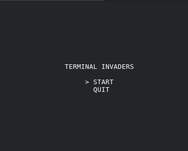
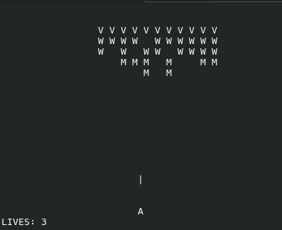
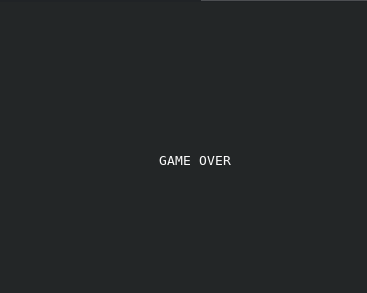

# Terminal Invaders

A simple **Space Invaders-inspired terminal game** written in **C**, using low-level UNIX terminal handling with `termios`, ANSI escape sequences, and a custom game loop.

This project was built as a learning experience focused on:
- low-level terminal programming
- real-time game loops
- raw keyboard input
- entity systems
- framebuffer-style rendering
- gameplay architecture in C

---

## Features

- Real-time game loop running at fixed FPS
- Raw keyboard input using `termios`
- ANSI escape sequence rendering
- Custom framebuffer renderer
- Menu system
- Enemy movement system
- Bullet spawning and collision handling
- Game over state
- Win/loss conditions
- Dynamic entity management using compact arrays
- Fully written in C without external game libraries

---

## Screenshots

### Main Menu



---

### Gameplay



---

### Game Over



---

## Controls

### Menu

| Key | Action |
|---|---|
| `W` | Move selection up |
| `S` | Move selection down |
| `SPACE` | Confirm option |

### Gameplay

| Key | Action |
|---|---|
| `A` | Move ship left |
| `D` | Move ship right |
| `SPACE` | Shoot |

### Game Over

| Key | Action |
|---|---|
| `SPACE` | Return to main menu |

---

## Build

Compile the project using:

```bash
make
```

---

## Run

```bash
./invaders
```

---

## Technical Details

### Terminal Handling

The game uses:
- `termios`
- raw terminal mode
- non-canonical input
- ANSI escape sequences

to create a real-time terminal game experience.

### Rendering

Rendering is done through:
- a dynamically allocated screen buffer
- manual framebuffer reconstruction
- terminal cursor repositioning (`ESC[H]`)
- direct writes to `STDOUT_FILENO`

### Game Architecture

The project is separated into systems/modules such as:
- input
- renderer
- gameplay
- menu
- terminal handling
- utilities

### Entity Systems

Entities are managed using compact arrays:
- bullets
- enemies

Objects are removed using swap-with-last techniques for efficient O(1) removal.

---

## Project Goals

This project was created primarily to deepen understanding of:
- C programming
- UNIX/Linux internals
- terminal systems
- game loop architecture
- low-level input/output
- memory management
- software modularization

---

## License

This project is licensed under the MIT License.


